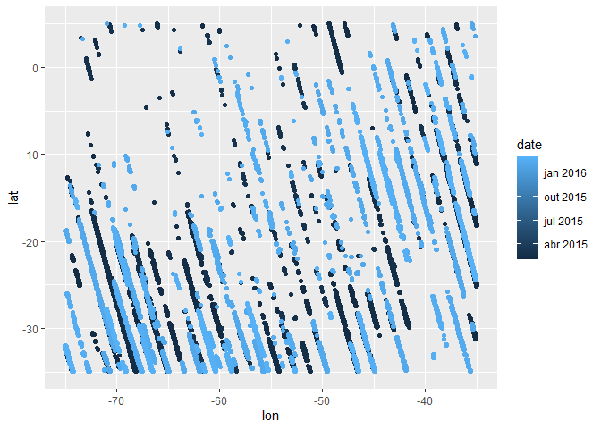
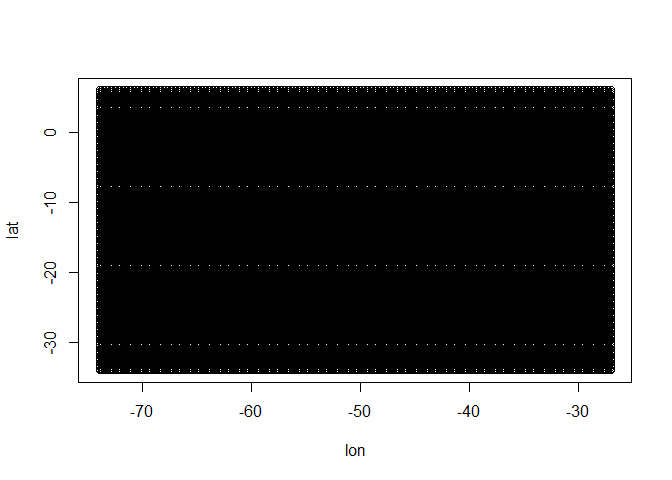
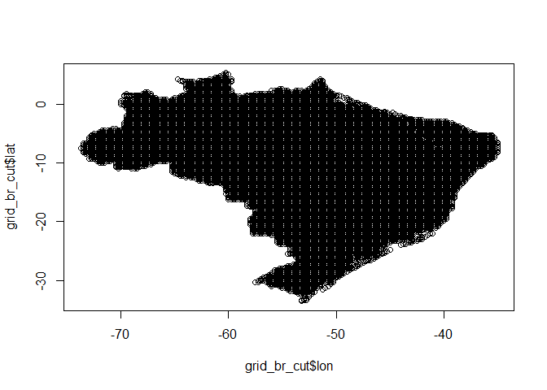
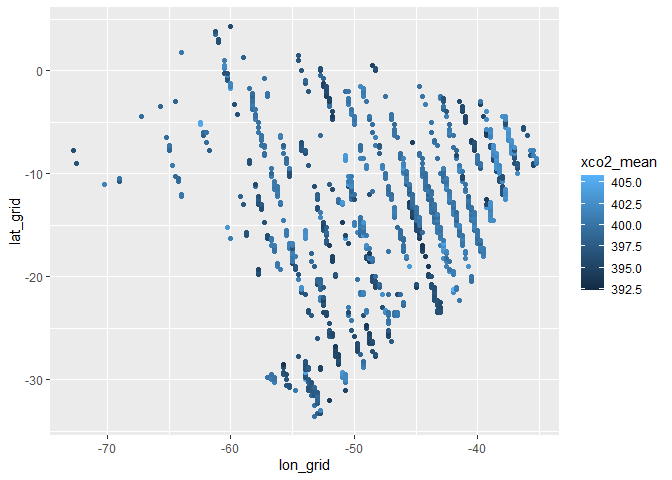

# **Agragação espacial para dados geograficos**

***Luis M. Costa***

## **Considerações Iniciais**

Este repositorio é um exemplo de como agregar dados geograficos, será
utilizado como exemplo dados baixados do satélite
[OCO-2](https://disc.gsfc.nasa.gov/datasets/OCO2_L2_Lite_FP_11.1r/summary).
Os arquivos estão em formato `.nc`, então primeiramente iremos estrair
os dados.

## **Extração de dados e visualização**

``` r
files_nc <- list.files('data-raw/', pattern = 'nc')

for(i in 1:length(files_nc)){
  if(i==1){
    df <- ncdf4::nc_open(paste0('data-raw/',files_nc[i]))
    if (df$ndims == 0){

    }else{
      xco2 <- data.frame(
        'lon' = ncdf4::ncvar_get(df,varid='longitude'),
        'lat' = ncdf4::ncvar_get(df,varid='latitude'),
        'time' = ncdf4::ncvar_get(df,varid='time'),
        'xco2' = ncdf4::ncvar_get(df,varid='xco2'),
        'uncertanty' = ncdf4::ncvar_get(df,varid='xco2_uncertainty'),
        'quality_flag' = ncdf4::ncvar_get(df,varid='xco2_quality_flag')
      ) |>
        dplyr::filter(lon < -35 & lon >-75 & lat < 5 & lat >-35) |> # região brasileira
        dplyr::filter(quality_flag == 0)
    }
    ncdf4::nc_close(df)
  }else{
    df_a <- ncdf4::nc_open(paste0('data-raw/',files_nc[i]))
    if (df_a$ndims == 0){
    }else{
      xco2_a <- data.frame(
        'lon' = ncdf4::ncvar_get(df_a,varid='longitude'),
        'lat' = ncdf4::ncvar_get(df_a,varid='latitude'),
        'time' = ncdf4::ncvar_get(df_a,varid='time'),
        'xco2' = ncdf4::ncvar_get(df_a,varid='xco2'),
        'uncertanty' = ncdf4::ncvar_get(df_a,varid='xco2_uncertainty'),
        'quality_flag' = ncdf4::ncvar_get(df_a,varid='xco2_quality_flag')
      )|>
        dplyr::filter(lon < -35 & lon >-75 & lat < 5 & lat >-35)|> 
        dplyr::filter(quality_flag ==0)}
    ncdf4::nc_close(df_a)
    xco2 <- rbind(xco2,xco2_a)
  }
}

xco2 <- xco2 |>
  dplyr::mutate(
    date = as.Date.POSIXct(time))

rm(df,df_a,xco2_a,files_nc,i)
```

``` r
xco2 |> 
  ggplot2::ggplot(ggplot2::aes(x=lon,y=lat,col=date))+
  ggplot2::geom_point()
```

<!-- -->

No caso do `OCO-2`, teoricamente é para existir uma observação em uma
determinada localidade a cada 15/16 dias, contudo, apesar de existirem
coordenadas proximas, existe um certo desvio na trajetoria, podemos
confirmar isso agregando os dados

``` r
xco2_agg <- xco2 |>
  dplyr::mutate(ano = lubridate::year(date),
                mes = lubridate::month(date)) |> 
  dplyr::group_by(lon,lat,ano,mes) |> 
  dplyr::summarise(xco2 = mean(xco2))
    
nrow(xco2_agg) == nrow(xco2)
```

    ## [1] TRUE

Como o numero de linhas dos dois dataset são iguais, isso significa, que
não existem coordenadas iguais. Diante disso é necessário agregar esses
dados em espacialmente, dependendo da finalidade do estudo

## **Criando o Grid amostral**

Iremos criar um grid para o territorio brasileiro, com uma distancia de
0.25°. Note que a depender da sua necessidade, essa distancia pode ser
maior ou menor. **CUIDADOS**, uma distancia muito pequena, irá gerar um
grid muito grande e isso pode elevar o custo computacional.

``` r
dist <- 0.25 #distancia desejada

grid_br <- expand.grid(lon=seq(-74, #lon min
                             -27, # lon max
                             dist),
                       lat=seq(-34, # lat min
                             6, # lat max
                             dist))
plot(grid_br)
```

<!-- --> Note que essa
função gerou um retangulo com diversos pontos igualmente espaçados,
agora devemos filtrar somente para os dentro do territorio nacional

``` r
source('r/def_pol.R') # função para filtrar dados dentro de um poligono

br <- geobr::read_country(showProgress = FALSE)
region <- geobr::read_region(showProgress = FALSE)

# poligonos
pol_br <- br$geom |> purrr::pluck(1) |> as.matrix()
pol_north <- region$geom |> purrr::pluck(1) |> as.matrix()
pol_northeast <- region$geom |> purrr::pluck(2) |> as.matrix()
pol_southeast <- region$geom |> purrr::pluck(3) |> as.matrix()
pol_south <- region$geom |> purrr::pluck(4) |> as.matrix()
pol_midwest<- region$geom |> purrr::pluck(5) |> as.matrix()

# corrigindo alguns pontos desses poligonos

pol_br <- pol_br[pol_br[,1]<=-34,]
pol_br <- pol_br[!((pol_br[,1]>=-38.8 & pol_br[,1]<=-38.6) &
                     (pol_br[,2]>= -19 & pol_br[,2]<= -16)),]

pol_northeast <- pol_northeast[pol_northeast[,1]<=-34,]
pol_northeast <- pol_northeast[!((pol_northeast[,1]>=-38.7 &
                                  pol_northeast[,1]<=-38.6) &
                                 pol_northeast[,2]<= -15),]

pol_southeast <- pol_southeast[pol_southeast[,1]<=-30,]


# filtrando o grid
grid_br_cut <- grid_br |>
  dplyr::mutate(
    flag_br = def_pol(lon,lat,pol_br),
    flag_north = def_pol(lon,lat,pol_north),
    flag_northeast = def_pol(lon,lat,pol_northeast),
    flag_midwest= def_pol(lon,lat,pol_midwest),
    flag_southeast = def_pol(lon,lat,pol_southeast),
    flag_south = def_pol(lon,lat,pol_south)
    ) |>
  tidyr::pivot_longer(
    tidyr::starts_with('flag'),
    names_to = 'region',
    values_to = 'flag'
  ) |>
  dplyr::filter(flag) |>
  dplyr::select(lon,lat) |>
  dplyr::group_by(lon,lat) |>
  dplyr::summarise(
    n_obs = dplyr::n()
  )

plot(grid_br_cut$lon,grid_br_cut$lat)
```

<!-- -->

## **Agregação**

``` r
xco2_agg <- xco2 |> 
  dplyr::mutate(
    ano = lubridate::year(date),
    mes = lubridate::month(date)
  )


for(i in 2015:2016){ # como neste exemplo só estamos utilizando dados de fev de 15 e  16
  aux_xco2 <- xco2_agg |> # tabela auxiliar
    dplyr::filter(ano==i)
  vct_xco2 <- vector();dist_xco2 <- vector(); # vetores vazios necessarios
  lon_grid <- vector();lat_grid <- vector();
  for(k in 1:nrow(aux_xco2)){
    d <- sqrt((aux_xco2$lon[k]-grid_br_cut$lon)^2+  # calculo da distancia entre as obs e o grid
                (aux_xco2$lat[k]-grid_br_cut$lat)^2
              )
    min_index <- order(d)[1]
    vct_xco2[k] <- aux_xco2$xco2[min_index]
    dist_xco2[k] <- d[order(d)[1]]
    lon_grid[k] <- grid_br_cut$lon[min_index]
    lat_grid[k] <- grid_br_cut$lat[min_index]
    }
  aux_xco2$dist_xco2 <- dist_xco2
  aux_xco2$xco2_new <- vct_xco2
  aux_xco2$lon_grid <- lon_grid
  aux_xco2$lat_grid <- lat_grid
  if(i == 2015){
    xco2_agg_novo <- aux_xco2
  }else{
    xco2_agg_novo <- rbind(xco2_agg_novo,aux_xco2)
  }
}

# conferindo

xco2_agg_novo |>
  dplyr::mutate(
    dist_conf = sqrt((lon - lon_grid)^2 + (lat - lat_grid)^2)
  ) |>
  dplyr::glimpse()
```

    ## Rows: 63,553
    ## Columns: 14
    ## $ lon          <dbl> -35.10326, -35.06885, -35.08171, -35.06052, -35.03951, -3…
    ## $ lat          <dbl> -31.25987, -31.22725, -31.23199, -31.20382, -31.17524, -3…
    ## $ time         <dbl> 1422806919, 1422806919, 1422806919, 1422806919, 142280692…
    ## $ xco2         <dbl> 396.6870, 396.3368, 395.9751, 396.3358, 396.8625, 396.416…
    ## $ uncertanty   <dbl> 0.3509335, 0.4123797, 0.3965880, 0.4030619, 0.4795962, 0.…
    ## $ quality_flag <int> 0, 0, 0, 0, 0, 0, 0, 0, 0, 0, 0, 0, 0, 0, 0, 0, 0, 0, 0, …
    ## $ date         <date> 2015-02-01, 2015-02-01, 2015-02-01, 2015-02-01, 2015-02-…
    ## $ ano          <dbl> 2015, 2015, 2015, 2015, 2015, 2015, 2015, 2015, 2015, 201…
    ## $ mes          <dbl> 2, 2, 2, 2, 2, 2, 2, 2, 2, 2, 2, 2, 2, 2, 2, 2, 2, 2, 2, …
    ## $ dist_xco2    <dbl> 10.76060, 10.75772, 10.75307, 10.74518, 10.73699, 10.7326…
    ## $ xco2_new     <dbl> 395.9012, 395.9012, 395.9012, 395.9012, 395.9012, 395.901…
    ## $ lon_grid     <dbl> -42, -42, -42, -42, -42, -42, -42, -42, -42, -42, -42, -4…
    ## $ lat_grid     <dbl> -23, -23, -23, -23, -23, -23, -23, -23, -23, -23, -23, -2…
    ## $ dist_conf    <dbl> 10.76060, 10.75772, 10.75307, 10.74518, 10.73699, 10.7326…

``` r
# conferindo se todas as distancias são identicas, se o resultado não for true, significa que alguma coordenada não foi indexada corretamente

nrow(xco2_agg_novo |>
  dplyr::mutate(
    dist_conf = sqrt((lon - lon_grid)^2 + (lat - lat_grid)^2),
    dist_bol = dist_xco2 - dist_conf
  ) |> 
  dplyr::filter(dist_bol ==0)) == nrow(xco2_agg_novo)
```

    ## [1] TRUE

``` r
## criando uma tabela com os dados agregados por lon e lat do grid


xco2_agg_novo |> 
  dplyr::filter(dist_xco2<0.15) |>
  dplyr::group_by(lon_grid,lat_grid,ano,mes) |> # agora podemos agregar os dados pelas coordenadas do grid
  dplyr::summarise(
    xco2_mean = mean(xco2_new),
    uncertanty_mean = mean(uncertanty),
    xco2_sd = sd(xco2_new),
    nobs = dplyr::n(),
    xco2_se = xco2_sd/sqrt(nobs))
```

    ## # A tibble: 973 × 9
    ## # Groups:   lon_grid, lat_grid, ano [973]
    ##    lon_grid lat_grid   ano   mes xco2_mean uncertanty_mean xco2_sd  nobs xco2_se
    ##       <dbl>    <dbl> <dbl> <dbl>     <dbl>           <dbl>   <dbl> <int>   <dbl>
    ##  1    -72.8    -7.75  2015     2      396.           0.513       0     2       0
    ##  2    -72.5    -9     2015     2      397.           0.587      NA     1      NA
    ##  3    -70.2   -11     2016     2      401.           0.518       0    10       0
    ##  4    -69     -10.8   2016     2      397.           0.565       0     7       0
    ##  5    -69     -10.5   2016     2      400.           0.557       0    20       0
    ##  6    -67.2    -4.5   2015     2      399.           0.772      NA     1      NA
    ##  7    -65.8    -3.5   2015     2      399.           0.592       0     2       0
    ##  8    -65.2    -6.5   2015     2      399.           0.559      NA     1      NA
    ##  9    -65      -7.75  2015     2      399.           0.595       0    12       0
    ## 10    -65      -7.5   2015     2      399.           0.599       0    13       0
    ## # ℹ 963 more rows

``` r
## distribuição espacial


xco2_agg_novo |>
  dplyr::filter(dist_xco2<0.15) |> # distancia maxima desejada
  dplyr::group_by(lon_grid,lat_grid,ano,mes) |> # agora podemos agregar os dados pelas coordenadas do grid
  dplyr::summarise(
    xco2_mean = mean(xco2_new),
    uncertanty_mean = mean(uncertanty),
    xco2_sd = sd(xco2_new),
    nobs = dplyr::n(),
    xco2_se = xco2_sd/sqrt(nobs)
  ) |>
  ggplot2::ggplot(ggplot2::aes(x=lon_grid,y=lat_grid,col=xco2_mean))+
  ggplot2::geom_point()
```

<!-- -->

``` r
# salvando a tabela

write.csv(xco2_agg_novo |>
  dplyr::filter(dist_xco2<0.15) |> # distancia maxima desejada
  dplyr::group_by(lon_grid,lat_grid,ano,mes) |> # agora podemos agregar os dados pelas coordenadas do grid
  dplyr::summarise(
    xco2_mean = mean(xco2_new),
    uncertanty_mean = mean(uncertanty),
    xco2_sd = sd(xco2_new),
    nobs = dplyr::n(),
    xco2_se = xco2_sd/sqrt(nobs)
  ), 'data/tabela_agregada.csv')
```

# **Considerações finais**

Este tipo de abordagem pode ser usada para qualquer dados
geograficamente distribuido.
